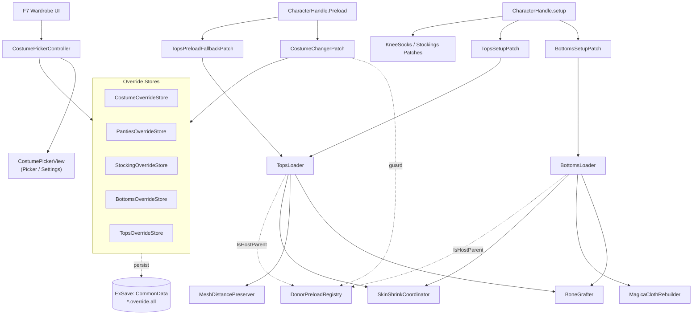
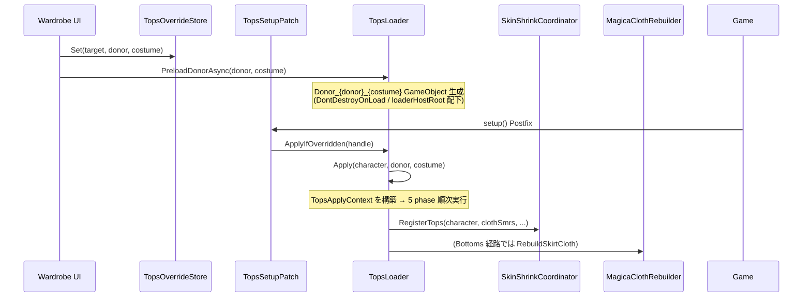

# CostumeChanger 仕様

Bunny Garden 2 向け FixMod のキャラクター衣装変更機構の概要。
BepInEx + Harmony で `CharacterHandle.Preload` / `setup` をフックし、衣装 / 下着 / ストッキング / 上衣・下衣移植を実現する。

対象コード: [`BunnyGarden2FixMod/Patches/CostumeChanger/`](../BunnyGarden2FixMod/Patches/CostumeChanger/)

---

## 1. 全体像

### 機能カテゴリ

| カテゴリ | 概要 | 主要コンポーネント |
|---------|------|------------------|
| **Costume Override** | 表示衣装の差し替え (DLC 含む) | `CostumeChangerPatch`, `CostumeOverrideStore` |
| **Panties / Stocking Override** | 下着 / ストッキングの差し替え | `PantiesOverrideStore`, `StockingOverrideStore`, `KneeSocksLoader`, `StockingsDonorLoader`, `PantiesAltSlotMatchPatch` |
| **Bottoms Transplant** | 別キャラ・別衣装の下衣 (skirt / pants 等) を移植 | `BottomsLoader`, `BottomsOverrideStore`, `BottomsSetupPatch` |
| **Tops Transplant** | 別キャラ・別衣装の上衣 (服) を移植 | `TopsLoader`, `TopsOverrideStore`, `TopsSetupPatch`, `TopsPreloadFallbackPatch` |
| **Mesh / Bone 補正** | 移植時の頂点・骨整合 | `BoneGrafter`, `MeshDistancePreserver`, `MeshBlendShapeTransplanter`, `MeshPenetrationResolver`, `MeshSurfaceOffsetAdjuster`, `BlendShapeFalloffApplier` |
| **SkinShrink 統合制御** | 移植後の skin push 干渉解消 | `SkinShrinkCoordinator` |
| **MagicaCloth2 物理 rebuild** | 衣装 swap / inject 後の物理クロス再構築 + collider clone | `MagicaClothRebuilder`, `MagicaClothInjectedColliderMarker` |
| **Wardrobe UI** | F7 で開く衣装選択パネル (5 タブ + Settings) | `UI/CostumePickerController`, `UI/CostumePickerView.*` |
| **Wardrobe 履歴 / Live patches** | 既ロード経路 / Album 等で履歴汚染しないガード | `WardrobeHistoryGate`, `WardrobeLastLoadArg`, `WardrobeLivePatches`, `*ViewHistory` |
| **永続化 (ExSave)** | override 状態を save slot ごとに保存 | 各 `*OverrideStore.RehydrateFromExSave` + `Internal/OverrideStorePersistence` |
| **共通 helper** | Loader 間の重複集約 | `Internal/CharacterResolver`, `CostumeMeshSwapper`, `DonorPreloadCache<T>`, `DonorPreloadRegistry`, `SmrSnapshotStore` |

### 構成図



`CostumeChangerPatch` は `CharacterHandle.Preload` の Prefix で各 Store の override 値を `LoadArg` に注入。
`BottomsSetupPatch` / `TopsSetupPatch` は `CharacterHandle.setup` の Postfix で `ApplyIfOverridden` を呼び、
preload が完了した SMR に対して移植処理を適用する。
`TopsPreloadFallbackPatch` は同 char/costume の re-Preload で `setup()` が呼ばれない経路 (= "Already loaded") の Apply を補う。

---

## 2. Bottoms / Tops Transplant フロー

### ハイレベル



### Apply の処理段階 (TopsApplyContext / BottomsApplyContext)

`Apply` は context struct を組んで phase メソッドへ ref で渡す形に分割されている。
target / donor SMR / 候補リスト / 設定値 / additive モード等を struct に集約し、各 phase は struct の中身だけ参照する。

#### TopsLoader.Apply (5 phase)

| Phase | メソッド | 処理概要 |
|------|---------|---------|
| 1 | `ApplySmrPhase` | (a) target 既存 Tops 候補に donor SMR を `CostumeMeshSwapper.SwapSmr` で swap / (b) donor のみ持つ SMR を inject / (c) target のみ持つ SMR を hide |
| 2 | `ApplySwimWearBottomsPhase` | LUNA SwimWear 等 SwimWear donor の Bottoms 候補名 SMR (frill 系等。`mesh_costume_skirt` は除外) を target に inject/swap (BottomsLoader と独立、両 frill 共存) |
| 3 | `ApplySkinUpperPhase` | `mesh_skin_upper` を Babydoll donor (固定) の skin asset に swap。Tops 移植時の境界整合の素状態を確定 |
| 4 | `ApplyDistancePreservePhase` | `MeshDistancePreserver.Preserve` で donor cloth 頂点を target skin に対して距離保存 (Pass 1〜4) |
| 5 | `ApplySkinShrinkPhase` | `SkinShrinkCoordinator.RegisterTops` を呼び、TopsSkinShrink contribution を登録 (実 push は Coordinator 側) |

完了後 `s_applied.Add(instanceId)` で再 Apply を dedup。

#### BottomsLoader.Apply (2 phase + MagicaCloth rebind)

| Phase | メソッド | 処理概要 |
|------|---------|---------|
| 1 | `ApplySmrPhase` | (a) swap / (b) inject / (c) hide。`AdditiveMode` (target=SwimWear/Bunnygirl) では (a)(c) を skip して (b) inject のみ。target が Bottoms 候補ゼロ (Bunnygirl 等) でも (b) で donor skirt を overlay 注入 |
| 2 | `ApplySkinShrinkPhase` | `SkinShrinkCoordinator.RegisterBottoms` で BottomsSkinShrink contribution を登録 |
| - | `RebindMagicaClothIfActive` | donor `MagicaCloth_Skirt` config を deep clone して target に rebuild |

#### Donor Preload (`DonorPreloadCache<T>`)

`PreloadDonorAsync(CharID donor, CostumeType costume)` は以下を行う:

1. `Donor_{donor}_{costume}` GameObject を Loader 自身の `s_loaderHostRoot` 配下に生成 (DontDestroyOnLoad)
2. `CharacterHandle` を attach し `Preload` を呼ぶ (donor 衣装 prefab を実体化)
3. 完了後 `DonorPreloadCache.s_donors[(donor, costume)]` にエントリ登録 (Handle / SMR snapshot)
4. in-flight task は cache 内 `s_inFlight` でガード (二重 preload 抑止)

donor preload 中の `CharacterHandle.Preload` には FixMod 自身の `CostumeChangerPatch` が再帰的に作用しうる。これを防ぐため `CostumeChangerPatch` および各 `*Loader.ApplyIfOverridden` は `DonorPreloadRegistry.IsAnyHostParent(parent)` で全 Loader の host を or 結合判定し、Prefix/Postfix を skip する。

#### Restore (移植解除)

`*Loader.RestoreFor(GameObject character)` は `SmrSnapshotStore` の (kind, instanceId, smrKind, isInjected) エントリから元の `sharedMesh` / `bones` / `OriginalActive` / `OriginalEnabled` を復元する。
`InjectedGo` (target に存在せず donor 側にあった SMR を inject したケース) は `SetParent(null)` 後 `Object.Destroy`。
完了後:

- `BoneGrafter.DestroyGrafted(character, ownerTag)` で graft した骨 subtree を破棄
- `SkinShrinkCoordinator.UnregisterTops` / `UnregisterBottoms` で skin push の contribution を解除 (skin SMR は Coordinator が素 mesh に rewind + 残存 contribution で再 push)
- (Bottoms のみ) `MagicaClothRebuilder.RestoreSkirtCloth(character)` で物理 component を元 config から逆 rebuild + inject collider を destroy

---

## 3. 主要コンポーネント

### BottomsLoader / TopsLoader

[`BottomsLoader.cs`](../BunnyGarden2FixMod/Patches/CostumeChanger/BottomsLoader.cs) (~730 行) /
[`TopsLoader.cs`](../BunnyGarden2FixMod/Patches/CostumeChanger/TopsLoader.cs) (~1030 行)

`MonoBehaviour` 派生 (Initialize で host GO に attach)。public/internal static API:

| API | 用途 |
|-----|------|
| `Initialize(GameObject parent)` | Plugin.cs から起動時に 1 回呼ぶ。`DonorPreloadCache` の host root を作成して `DonorPreloadRegistry` に登録 |
| `IsLoaded` | 初期化済かどうか |
| `IsBottomsCandidate(SMR)` / `IsTopsCandidate(SMR)` | SMR 名から移植対象判定 (互いに disjoint) |
| `PreloadDonorAsync(CharID, CostumeType)` | donor 衣装を preload (UniTask) |
| `ApplyIfOverridden(CharacterHandle)` | Store に登録された override を適用。FittingRoom / 他 Loader の preload host / `RespectGameCostumeOverride` 等のガード後に Apply 実行 |
| `ApplyDirectly(GameObject, CharID, CostumeType)` | Store 経由なし直接適用 (live tune / ApplyContext 構築点) |
| `Apply(GameObject, CharID, CostumeType)` | 移植処理本体 (ApplyContext + phase メソッド) |
| `RestoreFor(GameObject)` | 移植解除 |
| `IsDonorPreloadParent(GameObject)` | donor host 配下判定 (`DonorPreloadCache.IsHostParent` を委譲) |
| `GetTransplantedBottomsKinds(donor, costume)` (Bottoms) / `GetOwnedBottomsCandidateGoIds(character)` (Tops) | per-loader isolation 用の disjoint key 集合 |

static state:
- `s_cache` = `DonorPreloadCache<DonorEntry>`: (donor, costume) → DonorEntry のキャッシュ + in-flight タスク管理 + host root 配下判定
- `s_applied`: 適用済 character の InstanceID
- (Tops のみ) `s_resolvedCache`: Pass 1〜4 結果 Mesh のキャッシュ (MeshDistancePreserver 用 5 軸キー)
- snapshot は `Internal/SmrSnapshotStore` に集約 (kind = Tops / Bottoms で分離)

### Internal/ helpers

Loader 間で重複していたコードを集約した薄い層。

| ファイル | 役割 |
|---------|------|
| [`Internal/CharacterResolver.cs`](../BunnyGarden2FixMod/Patches/CostumeChanger/Internal/CharacterResolver.cs) | env と HoleScene の `m_characters` を順走査して `GameObject → CharacterHandle` を逆引き。同伴イベント等で env != HoleScene のとき HoleScene 側 PC を取りこぼさない |
| [`Internal/CostumeMeshSwapper.cs`](../BunnyGarden2FixMod/Patches/CostumeChanger/Internal/CostumeMeshSwapper.cs) | donor SMR の `sharedMesh` / `bones` (リマップ) / `sharedMaterials` を target SMR に swap する共通 helper。`_trp` 系は強制 enable を skip |
| [`Internal/DonorPreloadCache.cs`](../BunnyGarden2FixMod/Patches/CostumeChanger/Internal/DonorPreloadCache.cs) | `DonorPreloadCache<TEntry>` 汎用 cache。host root / in-flight task / (donor, costume) → entry の 3 役を 1 クラスに集約。Loader が `BuildDonorEntry` delegate を渡して使う |
| [`Internal/DonorPreloadRegistry.cs`](../BunnyGarden2FixMod/Patches/CostumeChanger/Internal/DonorPreloadRegistry.cs) | 全 Loader の `IsHostParent` を集約。新 Loader を追加するたびに or で並べる重複を構造的に排除 |
| [`Internal/OverrideStorePersistence.cs`](../BunnyGarden2FixMod/Patches/CostumeChanger/Internal/OverrideStorePersistence.cs) | 各 OverrideStore の ExSave Read/Write を共通化。rehydrate 失敗時は `s_rehydrateFailed=true` で write を抑止して破損データから保護 |
| [`Internal/SmrSnapshot.cs`](../BunnyGarden2FixMod/Patches/CostumeChanger/Internal/SmrSnapshot.cs) | `SmrSnapshot` struct + `SmrSnapshotStore` 静的 dict。`(SnapshotKind, instanceId, smrKind, isInjected)` を主キーに `OriginalActive` / `OriginalEnabled` / `OriginalMesh` / `OriginalBones` / `OriginalMaterials` / `InjectedGo` を保持 |

### BoneGrafter

[`BoneGrafter.cs`](../BunnyGarden2FixMod/Patches/CostumeChanger/BoneGrafter.cs) (~200 行)

donor SMR の `bones[]` に含まれる固有名 (`L_skirtA1_SW_skinJT` 等) を target hierarchy で解決する。

`ResolveAndGraft(donor, target, bones, ownerTag)` は 4 段階フォールバック:

1. **直接名前一致**: target hierarchy に同名 Transform があれば即解決
2. **正規化**: `_SW_` 等の中間 token を除去 (`L_skirtA1_SW_skinJT` → `L_skirtA1_skinJT`) して再検索 → target 標準骨にマップ。target Animator (`skirt_swaying_lp` 等) で物理が自動駆動
3. **Graft**: donor の Transform-only clone を target に植え替え (bindpose 互換用、physics 無し)
4. **rootBone fallback**: 最終手段。verts は rootBone に collapse して概ね不可視になる

**per-loader isolation**: graft した骨には `GraftedBoneMarker.OwnerTag = "BottomsLoader"` または `"TopsLoader"` が付く。Bottoms/Tops 同時適用時に互いの clone を破壊しないよう、`ResolveAndGraft` は別 owner subtree を探索対象から除外する。

`DestroyGrafted(character, ownerTag)` は marker 一致の subtree のみ破棄。`SetParent(null)` で先 detach してから `Destroy` する (Unity の Destroy は frame 末で走るため、その前に親子関係から外しておかないと次の Apply で同じ subtree を二重に「graft 済み」と誤検出する罠がある)。

### MeshDistancePreserver

[`MeshDistancePreserver.cs`](../BunnyGarden2FixMod/Patches/CostumeChanger/MeshDistancePreserver.cs) (~1000 行)

Tops 移植専用。donor 服が donor 側 Babydoll skin にめり込んでいる箇所を **target skin に対して同じ距離関係になるように** 補正する。
`Preserve(donorCostumeSmr, donorSkinSmrs, targetSkinSmrs, maxNeighborDist, minOffset, skinSampleRadius, weightFalloffOuter, logTag)` の 4 パス:

| Pass | 目的 |
|------|------|
| 1 | donor 服頂点ごとに最近傍 donor skin 頂点を `SpatialGridIndex` で検索 |
| 2 | donor 服が donor skin にめり込んでいる箇所 (`signedD < minOffset`) で、近傍 donor skin 頂点を逆距離² 重み平均で内側へ凹ませる (`d_donor` を `minOffset` まで持ち上げる) |
| 3 | target skin の対応位置との差分を target 法線方向に push し、頂点位置を確定 |
| 4 | 距離が近い (skin 密着) 頂点ほど skin 側 boneWeight を blend (関節剥離防止)。Bottoms (skirt) には不適合 |

**設計判断**: donor 服頂点自体は触らず、reference skin だけを部分的に凹ませる。頂点間の push 量分散による裏面 flip が原理的に起きない方式。

### SkinShrinkCoordinator

[`SkinShrinkCoordinator.cs`](../BunnyGarden2FixMod/Patches/CostumeChanger/SkinShrinkCoordinator.cs) (~430 行)

Tops / Bottoms 双方の SkinShrink (target skin SMR を cloth より内側へ push する補正) を **character 単位で統合** する。

```
Tops Apply 末尾  → RegisterTops(character, clothSmrs, push, falloffR, sampleR)
Bottoms Apply 末尾 → RegisterBottoms(character, clothSmrs, push, falloffR, sampleR)
*Loader.RestoreFor   → UnregisterTops / UnregisterBottoms
live tune handler   → InvalidateCache + 再 Register (per-target ApplyDirectly 経由)
SceneManager.sceneUnloaded → ClearScene
```

public API:

| API | 用途 |
|-----|------|
| `RegisterTops(character, clothSmrs, push, falloffR, sampleR)` | Tops contribution を登録し RefreshOne |
| `RegisterBottoms(character, clothSmrs, push, falloffR, sampleR)` | Bottoms contribution を登録し RefreshOne |
| `UnregisterTops(character)` / `UnregisterBottoms(character)` | contribution を外し RefreshOne (残存 contribution で再 push) |
| `RestoreSkinUpperToOriginal(character, skinUpperSmr)` | TopsLoader.Apply (d) 直前で snapshot 入口を sanitize |
| `InvalidateCache()` | Mesh cache 全破棄 (live tune 用) |
| `RefreshAllByConfig()` | 全 entry を再 push (live tune handler) |
| `ClearScene()` | scene unload 時の entry クリア (s_cache は保持) |

実装の特徴:

- **素 mesh 1 箇所管理**: per-character entry に `OriginalSkinUpper` / `OriginalSkinLower` を保持。Refresh 時は両 skin SMR を素状態に rewind してから contribution を順次 push する (Tops → Bottoms 順)
- **Tops 有無で skin_upper の素が遷移**: Tops 有 = target Babydoll asset / Tops 無 = target 元 costume asset。`UnregisterTops` 後の再 Register で素を再捕捉する
- **face/eye anchor 集約**: skin push の falloff anchor として `mesh_face` / `mesh_eye` 系の頂点を採用。waist 縫い目で push 量が anchor 距離 0 になる問題を回避 (Bunnygirl 等で face SMR 不在なら skin 系 anchor に fallback)
- **API 契約**: `UnregisterTops` 呼出前に呼出元は `mesh_skin_upper.sharedMesh` を target 元 costume asset に戻し終えていること (`*Loader.RestoreFor` 末尾で呼ぶのはこの前提を満たす)

実 push は cloth SMR ごとに `MeshPenetrationResolver.Resolve` を呼び、結果 Mesh を `s_cache` ((skin Mesh, donor Mesh, push, falloffR, sampleR, srcTag, kindTag)) で deduplicate する。

### MagicaClothRebuilder

[`MagicaClothRebuilder.cs`](../BunnyGarden2FixMod/Patches/CostumeChanger/MagicaClothRebuilder.cs) (~1560 行)

Bottoms swap 後の MagicaCloth_Skirt (MeshCloth) 物理を **target SMR に対して再 build** する。MagicaCloth2 は `BuildAndRun` 後の component が "Already built" で再 build を拒むため、`Destroy → AddComponent → BuildAndRun` の流れを取る。target に cloth component 自体が存在しない (Bunnygirl の `mesh_costume_full` 等) ケースでは `TryCreateSkirtCloth` で新規生成する。

public API:

| API | 用途 |
|-----|------|
| `NormalizeSmrMeshBeforeSwap(character)` | snapshot 採取前に customMesh→originalMesh 巻き戻し (snapshot が dispose 済 customMesh を握る罠回避) |
| `RebuildSkirtCloth(character, donorHost)` | target の MeshCloth+Skirt を Destroy → 再 AddComponent → donor の serializeData を deep copy → `RemapColliderRefs` → `BuildAndRun`。target 側 cloth 不在なら `TryCreateSkirtCloth` 経路 |
| `RestoreSkirtCloth(character)` | snapshot 保存済の target 元 config から逆 rebuild。inject した collider は marker から逆引きして destroy |
| `ClearAllSnapshots()` | scene unload 時に呼ぶ |

実装の特徴:

- **全 reflection ベース**: `MagicaCloth2.MagicaCloth` 型は `AppDomain` 動的解決で、DLL 直 reference 無し (SDK バージョン差異耐性)
- **deep clone (`CopyFields(deep: true)`)**: List / sub-object を donor と共有しないよう field-wise clone。MagicaCloth2 namespace の custom class は再帰 deep-clone、donor 共有を避けるため raw 参照は流さない
- **Collider remap (`RemapColliderRefs`)**: `colliderCollisionConstraint.colliderList` (List<ColliderComponent>) と `collisionBones` (List<Transform>) を target 側同名 GameObject の同型 component / Transform に再マップ。`ReplaceTransform` は Transform のみ swap で Component refs 対象外なため必要
- **Collider clone / inject**: target に同名 GO 無 / 同型 component 無のケースを以下で吸収:
  - 同名 GO あり / 同型 component 無 → `CloneColliderTo` で `AddComponent`、`MagicaClothInjectedColliderMarker(DestroyGameObject=false)` 付与。Restore で component のみ destroy
  - 同名 GO 無 / 親 bone あり → `InjectColliderGo` で新規 GO 生成 + AddComponent、`Marker(DestroyGameObject=true)` 付与。Restore で GO ごと destroy
- **OnDisable 副作用回避 (`SafeDestroyPreservingSmrState`)**: Destroy 前に SMR state 保存 → Destroy 後に再適用 (`OnDisable` の `RenderData.SwapOriginalMesh` 副作用補正)
- **snapshot**: `s_snapshots[(InstanceId, SkirtGoName)] = (SerData, SerData2, SrcRenderers, CreatedByMod)` で復元用。`CreatedByMod=true` は `TryCreateSkirtCloth` 経路で、Restore 時に GameObject ごと destroy

### OverrideStore × 5

[`CostumeOverrideStore.cs`](../BunnyGarden2FixMod/Patches/CostumeChanger/CostumeOverrideStore.cs) /
[`PantiesOverrideStore.cs`](../BunnyGarden2FixMod/Patches/CostumeChanger/PantiesOverrideStore.cs) /
[`StockingOverrideStore.cs`](../BunnyGarden2FixMod/Patches/CostumeChanger/StockingOverrideStore.cs) /
[`BottomsOverrideStore.cs`](../BunnyGarden2FixMod/Patches/CostumeChanger/BottomsOverrideStore.cs) /
[`TopsOverrideStore.cs`](../BunnyGarden2FixMod/Patches/CostumeChanger/TopsOverrideStore.cs)

`Dictionary<CharID, Entry>` の薄いラッパー + ExSave 永続化。`Set` / `Clear` / `ClearAll` / `TryGet` / `EnumerateOverrides` / (Bottoms/Tops のみ) `EnumerateUniqueDonors`。

- `Set` / `Clear` 成功時に `WriteToExSave` を呼び ExSave (CommonData) に即時保存
- `RehydrateFromExSave()` は `ExSaveStore.LoadFromPath` 後に Plugin が呼び in-memory dict を再構築
- `OverrideStorePersistence` で Read/Write を共通化、`s_rehydrateFailed` で破損時 write 抑止
- `Configs.PersistCostumeOverrides=false` で永続化を無効化 (rehydrate / write を skip)

ExSave キー / value 型:

| Store | ExSave key | 値型 |
|-------|-----------|------|
| Costume | `costume.override.all` | `Dictionary<int, byte>` (CharID → CostumeType) |
| Panties | `panties.override.all` | `Dictionary<int, PantiesOverrideExSaveEntry>` (type, color) |
| Stocking | `stocking.override.all` | `Dictionary<int, byte>` (CharID → stocking type 0–7) |
| Bottoms | `bottoms.override.all` | `Dictionary<int, BottomsOverrideExSaveEntry>` (donorChar, donorCostume) |
| Tops | `tops.override.all` | `Dictionary<int, TopsOverrideExSaveEntry>` (donorChar, donorCostume) |

`StockingOverrideStore` は MOD 独自タイプ **5=KneeSocks / 6=KneeSocksBlack / 7=KneeSocksWhite** を持ち、`KneeSocksLoader` がこの 3 値を解釈する。

`PantiesOverrideExSaveEntry` 等の DTO は MessagePack StandardResolver の制約で **public class** 必須。

### CostumeChangerPatch / TopsPreloadFallbackPatch

[`CostumeChangerPatch.cs`](../BunnyGarden2FixMod/Patches/CostumeChanger/CostumeChangerPatch.cs) — `CharacterHandle.Preload` の `[HarmonyPatch]`。

- **Prefix**: Costume / Panties / Stocking の override を `LoadArg` に注入
- **Postfix**: 確定値を `*ViewHistory` 等に記録 (実 ApplyStocking / ReloadPanties Postfix での記録は `WardrobeLivePatches` で別途)
- **donor host parent ガード**: `DonorPreloadRegistry.IsAnyHostParent(parent)` で全 Loader の preload host 配下なら skip
- **FittingRoom guard**: FittingRoom 動作中は Costume / Panties / Stocking override を Clear (Bottoms / Tops は維持して新衣装に追従)

[`TopsPreloadFallbackPatch.cs`](../BunnyGarden2FixMod/Patches/CostumeChanger/TopsPreloadFallbackPatch.cs) — 同 char/costume の re-Preload で `setup()` が呼ばれない経路 (= "Already loaded !!" 早期 return / flag=true パス) で `TopsLoader.ApplyIfOverridden` を補完する。
flag=false 経路 (Unload 直後 + 非同期 Load) は `m_chara==null` で skip し、後続の `TopsSetupPatch` Postfix に Apply を委ねる。

### Wardrobe UI / 履歴 / Live patches

[`UI/CostumePickerController.cs`](../BunnyGarden2FixMod/Patches/CostumeChanger/UI/CostumePickerController.cs) — F7 hotkey、CharacterHandle 取得、5 タブ (Costume / Panties / Stocking / Bottoms / Tops) のロジック、各 Store への適用、Apply トリガ。

[`UI/CostumePickerView.cs`](../BunnyGarden2FixMod/Patches/CostumeChanger/UI/CostumePickerView.cs) — UI Toolkit (UIDocument) ベースの View。partial 分割:

| ファイル | 責務 |
|---------|------|
| `CostumePickerView.cs` | コア (描画ループ / レイアウト / nav / cast 切替) |
| `CostumePickerView.Picker.cs` | 5 タブ (COSTUME / PANTIES / STOCKING / BOTTOMS / TOPS) のグリッド + RenderData |
| `CostumePickerView.Settings.cs` | 解放状態リセット / すべて解放 (DLC unlock) |

スライダー類は F9 設定パネルへ集約済。

[`WardrobeHistoryGate.cs`](../BunnyGarden2FixMod/Patches/CostumeChanger/WardrobeHistoryGate.cs) — 履歴記録のガード共通 helper。`IsIngame=false` (タイトル / Album 等) / FittingRoom 動作中 / `GetCurrentCast()` 以外のキャラを除外。

[`WardrobeLastLoadArg.cs`](../BunnyGarden2FixMod/Patches/CostumeChanger/WardrobeLastLoadArg.cs) — キャラごとの直近 LoadArg をプロセス内に保持。`SetCurrentCast` 切替時に再 Preload が走らないため、履歴フラッシュにこのキャッシュを参照する。

[`WardrobeLivePatches.cs`](../BunnyGarden2FixMod/Patches/CostumeChanger/WardrobeLivePatches.cs) — `CharacterHandle.ReloadPanties` / `ApplyStocking` Postfix で、画面に出た最終値を `*ViewHistory.MarkViewed` に記録 (HistoryGate 経由)。

### その他のパッチ / helper

| ファイル | 役割 |
|---------|------|
| [`PantiesAltSlotMatchPatch.cs`](../BunnyGarden2FixMod/Patches/CostumeChanger/PantiesAltSlotMatchPatch.cs) | 水着 / バニーガールでも Panties 切替が反映されるよう `findPantiesMaterialIndex` を拡張 + 解除時に元 panty material を復元。`PantiesAltSlotOverrideOnly=true` で Mod 指定キャストのみに限定 |
| [`ApplyStockingNullGuardPatch.cs`](../BunnyGarden2FixMod/Patches/CostumeChanger/ApplyStockingNullGuardPatch.cs) | `mesh_skin_lower` / `mesh_foot_barefoot` の `sharedMesh==null` で `ApplyStocking` が NRE する経路をガード |
| [`SwimWearStockingPatch.cs`](../BunnyGarden2FixMod/Patches/CostumeChanger/SwimWearStockingPatch.cs) | 水着コスチューム着用中の `ApplyStocking` を同期化し、Uniform donor の blendShape を nearest-neighbor 移植して脚を細める。`StockingsDonorLoader` がドナーキャッシュ |
| [`KneeSocksLoader.cs`](../BunnyGarden2FixMod/Patches/CostumeChanger/KneeSocksLoader.cs) | StockingOverride 5/6/7 (KneeSocks 系) の実装。Luna Casual の `mesh_kneehigh` を donor として `mesh_stockings` を差し替え |
| [`MagicaClothInjectedColliderMarker.cs`](../BunnyGarden2FixMod/Patches/CostumeChanger/MagicaClothInjectedColliderMarker.cs) | inject collider の Restore 用識別マーカー |

---

## 4. 設定値 (Configs)

[`Configs.yaml`](../BunnyGarden2FixMod/Configs.yaml) → [`Generated/Configs.g.cs`](../BunnyGarden2FixMod/Generated/Configs.g.cs) に自動生成。
`F9` で live tune パネル表示、変更は即時反映 (Tops は `OnDistancePreserveParamChanged` / Bottoms は `OnBottomsSkinShrinkParamChanged` で同フレーム再 Apply、SkinShrink 系は `SkinShrinkCoordinator.InvalidateCache + RefreshAllByConfig`)。

| キー | 既定値 | 範囲 | 用途 |
|------|--------|------|------|
| `CostumeChangerEnabled` | true | bool | 機能全体 ON/OFF (要再起動) |
| `CostumeChangerShow` | F7 | hotkey | Wardrobe 表示 |
| `RespectGameCostumeOverride` | true | bool | ゲーム指定衣装を override より優先するか |
| `PersistCostumeOverrides` | true | bool | override 状態を ExSave に永続化するか |
| `PantiesAltSlotMatch` | true | bool | 水着・バニーで下着表示 |
| `PantiesAltSlotOverrideOnly` | true | bool | Mod で下着を指定したキャストのみ AltSlotMatch を適用 |
| `DisableStockings` | false | bool | キャストのストッキングを非表示 |
| `SwimWearStocking` | true | bool | 水着時の Stocking blendShape 移植 |
| `StockingOffset` | 0 | 0〜0.01 | stocking cloth を skin より外側に最低距離維持 (m) |
| `StockingSkinShrink` | 0.001 | 0〜0.01 | target.mesh_skin_lower を stocking より内側に push (m) |
| `StockingSkinFalloffRadius` | 0.001 | 0〜0.01 | 上記 push の境界フェード (m) |
| `StockingShapeFalloffRadius` | 0.001 | 0〜0.01 | skin_stocking blendShape delta の境界フェード (m) |
| `TopsDistancePreserveRange` | 0.100 | 0.010〜0.500 | 上衣 距離保存検索範囲 (m) |
| `TopsSkinMinOffset` | 0.005 | 0〜0.010 | 上衣 skin からの最小距離 (m) |
| `TopsSkinSampleRadius` | 0.03 | 0〜0.100 | 上衣 skin サンプル半径 (m) |
| `TopsSkinWeightFalloff` | 0.02 | 0〜0.050 | 上衣 skin weight 転送 falloff (m)。0 で無効 |
| `TopsSkinShrink` | 0.005 | 0〜0.010 | target.mesh_skin_upper を tops より内側へ push (m) |
| `TopsSkinShrinkFalloffRadius` | 0.001 | 0〜0.010 | 上記 push の境界フェード (m) |
| `TopsSkinShrinkSampleRadius` | 0 | 0〜0.100 | tops 肌押込み cloth サンプル半径 (m)。0 で K=3 固定 |
| `BottomsSkinShrink` | 0.005 | 0〜0.010 | target.mesh_skin_lower / mesh_skin_upper を skirt より内側へ push (m) |
| `BottomsSkinShrinkFalloffRadius` | 0.001 | 0〜0.010 | 上記 push の境界フェード (m) |
| `BottomsSkinShrinkSampleRadius` | 0.05 | 0〜0.1 | bottoms 肌押込み skirt サンプル半径 (m) |

詳細な意味は [`configs.md`](configs.md) と `Configs.yaml` の `description:` 欄を参照。

### 4.1 Tops / Bottoms / Stocking 補正系の整理

「似たような名前の設定が散らばってる」を整理するための分類表。
**補正対象 (cloth 側 / skin 側)** で機能が disjoint なので機能重複なし、併存可能。

#### (A) cloth (donor 服) 側を補正する系

target に移植する donor の cloth mesh を per-vert で補正する。**見た目を donor 通りに合わせる** のが目的。

| Config | 何をする | 実装 |
|--------|---------|------|
| `TopsDistancePreserveRange` | donor 元の浮き具合を target で再現 (donor cloth 頂点を target skin 法線方向に push) | [`MeshDistancePreserver.Preserve`](../BunnyGarden2FixMod/Patches/CostumeChanger/MeshDistancePreserver.cs) Pass 3 |
| `TopsSkinMinOffset` | **donor 内**で cloth が donor skin にめり込んでる箇所を、donor skin を凹ませて解消 (cloth 自体は触らない) | 同 Pass 2 |
| `TopsSkinSampleRadius` | skin 表面推定の K-NN サンプリング半径 | 同 全 Pass |
| `TopsSkinWeightFalloff` | cloth の boneWeight を skin 由来 weight と blend (関節曲げで剥離防止) | 同 Pass 4 |
| `StockingOffset` | stocking cloth を target skin より外側に最低距離維持 | [`MeshPenetrationResolver.Resolve`](../BunnyGarden2FixMod/Patches/CostumeChanger/MeshPenetrationResolver.cs) `minOffset` |

#### (B) target skin 側を補正する系 (SkinShrink)

target キャラの素肌 SMR (`mesh_skin_lower` / `mesh_skin_upper`) を per-vert で内側に凹ませる。**移植後の z-fighting / 貫通を解消** するのが目的。cloth の見た目は変えない。
3 ジャンル (Stocking / Tops / Bottoms) いずれも `SkinShrinkCoordinator` 経由で character 単位に統合され、両 override 同時適用時の干渉が起きない。

| Config | 何をする | 実装 |
|--------|---------|------|
| `StockingSkinShrink` | mesh_skin_lower を stocking より内側に push | `MeshPenetrationResolver.Resolve` `skinPushAmount` (SwimWearStockingPatch / KneeSocksLoader 経由) |
| `StockingSkinFalloffRadius` | 同フェード | 同 `skinFalloffRadius` |
| `TopsSkinShrink` / `TopsSkinShrinkFalloffRadius` / `TopsSkinShrinkSampleRadius` | mesh_skin_upper を tops より内側に push (skin 法線基準) | `SkinShrinkCoordinator.RegisterTops` → `MeshPenetrationResolver.Resolve` (`useSkinNormalForPush=true`) |
| `BottomsSkinShrink` / `BottomsSkinShrinkFalloffRadius` / `BottomsSkinShrinkSampleRadius` | mesh_skin_lower / mesh_skin_upper を skirt より内側に push | `SkinShrinkCoordinator.RegisterBottoms` (face/eye anchor で waist 縫い目フェード対策) |

**push 軸の違い**: Stocking は cloth (donor) 外向き法線を push 軸にする (tight な単面 stocking では skin 法線とほぼ一致)。Tops / Bottoms は `useSkinNormalForPush=true` で skin 法線を採用 — frill / sleeve / 双面ジオメトリで cloth 法線が局所反転すると `-cloth_normal` が外側を向き skin が逆方向に押されるため。

#### (C) blendShape delta 側

blendShape そのものの効きを境界で抑える系。

| Config | 何をする |
|--------|---------|
| `StockingShapeFalloffRadius` | `skin_stocking` blendShape の delta 自体を境界でフェード (ウエスト段差解消) |

#### 補正対象の違い (重要)

```
distance preservation (Tops 系 4 個):
  → donor cloth 頂点を補正 = "見た目を donor 通りに合わせる"
  → 副作用: donor で密着 (距離 0) なら target でも密着 → z-fighting 残ることがある

SkinShrink (Stocking / Tops / Bottoms):
  → target skin 頂点を補正 = "z-fighting / 貫通を解消"
  → cloth の見た目は変えない、肌が引っ込む
  → SkinShrinkCoordinator が両 override 同時適用時の干渉を解消
```

#### 「Tops / Bottoms 側 push (= Offset) を入れない」設計判断

Stocking は `StockingOffset` (cloth 外側 push) と `StockingSkinShrink` (skin 内側 push) の **二者択一 UX**。
Tops / Bottoms は distance preservation で fit が決まっているのでこの二者択一にしない。SkinShrink (skin 側 push) のみで z-fighting 解消する設計。

- distance preservation が既に「donor 元のフィット感」を再現済 → ここに `Offset` で「target skin から最低距離 X 維持」を足すと donor の見た目を歪める
- z-fighting 解消は skin 側を凹ませるだけで足り、cloth は触らない → distance preservation の結果も保たれる

実機で push 量不足が判明したら後付けで `*Offset` を足すのは小修正で対応可。

---

## 5. ライフサイクル

### 起動

```
Plugin.Awake
 └─ ExSaveStore.LoadFromPath
     └─ *OverrideStore.RehydrateFromExSave  ← in-memory dict 復元 (PersistCostumeOverrides=true 時)
 └─ CostumeChangerPatch.Initialize
     ├─ AccessTools.Field cache (m_parent, m_loading, m_charID)
     ├─ KneeSocksLoader.Initialize(host)
     ├─ BottomsLoader.Initialize(host)   → DonorPreloadCache + Registry 登録
     └─ TopsLoader.Initialize(host)      → 同上
```

### Apply (Wardrobe UI で donor 選択時)

```
Controller.OnDonorSelected
 ├─ TopsOverrideStore.Set(target, donor, costume)  → ExSave 保存 (即時)
 ├─ TopsLoader.PreloadDonorAsync(donor, costume).Forget()
 └─ TopsLoader.ApplyDirectly(handle.Chara, donor, costume) ← 既存 character に即時適用
     └─ Apply: TopsApplyContext を構築 → 5 phase 順次実行 → SkinShrinkCoordinator.RegisterTops
```

### Costume change (ゲーム本体経由)

```
CharacterHandle.Preload (flag=false 経路)
 ├─ CostumeChangerPatch.Prefix    ← Costume / Panties / Stocking 注入
 │   └─ DonorPreloadRegistry.IsAnyHostParent ガードで preload host 配下なら skip
 ├─ (本体処理: model load / anim load)
 ├─ CostumeChangerPatch.Postfix   ← ViewHistory 記録
CharacterHandle.setup
 ├─ BottomsSetupPatch.Postfix → BottomsLoader.ApplyIfOverridden
 └─ TopsSetupPatch.Postfix    → TopsLoader.ApplyIfOverridden

CharacterHandle.Preload (flag=true 経路 / "Already loaded !!")
 └─ TopsPreloadFallbackPatch.Postfix → TopsLoader.ApplyIfOverridden  (setup() が呼ばれないため補完)
```

### Scene unload

```
SceneManager.sceneUnloaded
 ├─ BottomsLoader.OnSceneUnloaded
 │   ├─ s_applied.Clear (InstanceID 再採番対策)
 │   └─ DonorPreloadCache: in-flight task は意図的に保持 (donorParent が DontDestroyOnLoad)
 ├─ TopsLoader.OnSceneUnloaded   ← 同上 + Mesh ネイティブ解放のため Object.Destroy
 ├─ MagicaClothRebuilder.ClearAllSnapshots
 └─ SkinShrinkCoordinator.ClearScene
     注: SmrSnapshotStore は意図的に Clear しない (m_holeScene の preserved PC 対策)
```

### FittingRoom

```
FittingRoom.setupGenreSelect
 └─ FittingRoomOnEnterPatch.Prefix
     ├─ CostumeOverrideStore.Clear
     ├─ PantiesOverrideStore.Clear
     └─ (Bottoms / Tops は維持)  ← 退出後の setup() Postfix で新衣装に対して再 Apply
```

### Save / Load

```
Saves.Load → ExSaveStore.LoadFromPath → *OverrideStore.RehydrateFromExSave
*OverrideStore.Set / Clear → OverrideStorePersistence.WriteToExSave → ExSaveStore.CommonData[*.override.all]
```
